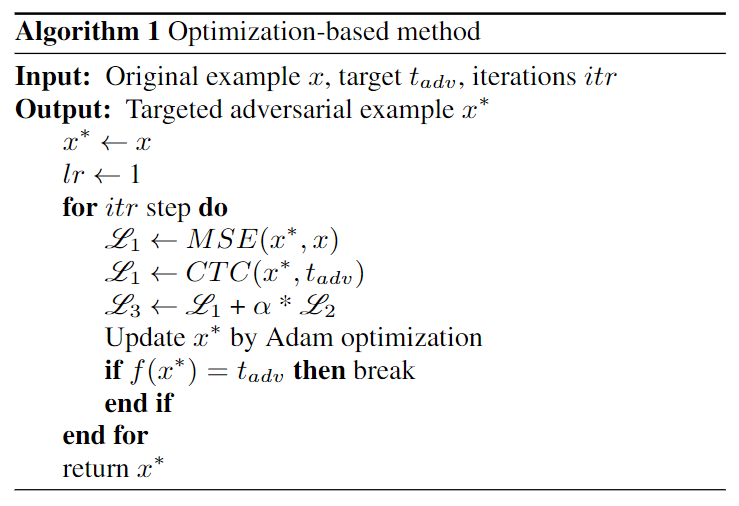
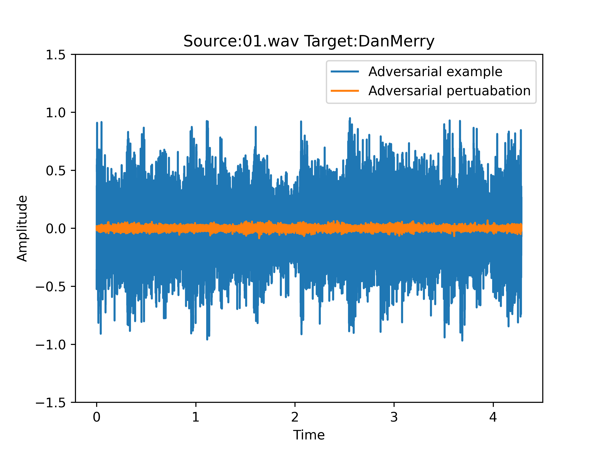

# CS_SpeechADV
The code of the CyberSecurity contest which is ranked number 2. Our method is a modfifed method based on the C&W which is combined some other loss funtions to conduct the higer SNR. The whole method is easy to go and the every adversarial example can be generated in 15min~2h. The results of our generated files can seen in [generated.txt](./generated/generated.txt), the four colums are the generated adversarial example (the failed attacked files are attached with 'failed'), the result of attack (True for success, False for failure), SNR of the generated adversarial example, target command of the method, respectively.The whole process can be described as follows:

# Usage
Our attack method can be seen in [OPT.py](./OPT.py). Maybe the adversarial examples can not be generated successfully at once, rerun the code and the or set higer iteration of the method in the provided file. In the following code, we need to add some needed paramters of the method, the `source` is the carrier of the attack method, `command` is the attack target which every thing you want to be attacked, `save` is the the address you want the adversarial example to besaved. Warning that do not add `!@#$%^'` and so on in the `command`, only space ` ` is allowed. Do not add `.wav` at the end of the `save`.

        python OPT.py --source [] --command [] --save []
for example:

        python OPT.py --source ./source/01.wav --command DanMerry --save ./generated/test_adv
The generated adversarial example can be seen as the following image, the generated adversarial perturbation is small enough that is almost imperceptible.

# Related file
The generated adversarial examples audio files are [here](https://pan.baidu.com/s/1Wth4kmrhk2lC1hLa9EdoUg), the code is `A246`.
